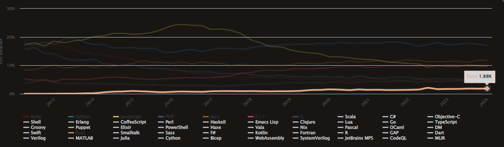

<!---
marp: true
theme: uncover
headingDivider: 3
paginate: true
--->


<!--
_class:
 - lead
 - invert
-->

# Rust Programming Language

A high level overview of the _latest_ highly admired programming language by developers.

<!--fit-->
<!-- _paginate: skip -->

## Foreword
<!-- _paginate: skip -->

📝 Contribute on [ GitHub](https://github.com/peterneave/rust)

🔗 View Online [neave.dev/rust](https://neave.dev/rust)

⬇️ Download [PowerPoint](https://neave.dev/rust/rust.pptx) and [PDF](https://neave.dev/rust/rust.pdf)

## Visibility

🔍 Looking for a Punch Buggies/Telsa Car/Car Rainbow - they are out there but you won't notice them until you start looking. 🚗

## What is Rust?
<!-- header: What is Rust -->


Based of the
[Rust Fungus](https://www.reddit.com/r/rust/comments/27jvdt/internet_archaeology_the_definitive_endall_source/).

The logo is a bike ring because most of the developers who started Rust [like to ride bikes](https://bugzilla.mozilla.org/show_bug.cgi?id=680521)

---

Graydon Hoare created Rust as personal project while working at Mozilla Research in 2006.

He realised that memory safety bugs where likely causing the elevator to break down in his apartment building.

>It’s ridiculous that we computer people couldn’t even make an elevator that works without crashing!

## Mascot

Ferris the crab


## Why Rust?
<!-- header: Why Rust -->

>Don't count your servers, make your servers count.

---

#### Make Cost a Non-Functional Requirement

> Ruby & Python are more than 50x more expensive than C++ and Rust

[The Frugal Architect](https://www.thefrugalarchitect.com/)
(quoted in [Why Rust? - Serverless Rust](
https://serverless-rust.com/docs/why-rust))

---

⚡ _Blazing Fast_ ⚡

Close to speed of C/C++.

[](https://benchmarksgame-team.pages.debian.net/benchmarksgame/box-plot-summary-charts.html)

---

[](https://en.wikipedia.org/wiki/Comparison_of_programming_languages)

### Why - Rust in the wild
<!-- header: Rust in the wild -->

- [Rust is in the Linux](https://en.wikipedia.org/wiki/Rust_for_Linux)
- [Microsoft seeks Rust developers to rewrite core C# code](https://www.theregister.com/2024/01/31/microsoft_seeks_rust_developers)
- Mozilla re-focuses on Web Engine Rust based 'Servo' in 2024.

---

- CloudFlare open sources their http proxy (alternative to NGINX) called [Pingora](https://blog.cloudflare.com/pingora-open-source)
- [RedoxOS](https://redox-os.org) - Redox is a Unix-like Operating System written in Rust.
- [Warp Terminal](https://www.warp.dev/) - an AI Powered Terminal
- [Using WebAssembly for Extension Development](https://code.visualstudio.com/blogs/2024/05/08/wasm)
- Renault electric passenger car brand Ampere SDV platform is written in Rust.

---

- [NSA cybersecurity information sheet](https://media.defense.gov/2022/Nov/10/2003112742/-1/-1/0/CSI_SOFTWARE_MEMORY_SAFETY.PDF) recommends we use memory safe languages  C#, Go, Java, Ruby, Swift and _Rust_.
- The White House Office of the National Cyber Director (ONCD) called on developers to reduce the risk of cyberattacks by using programming languages that don’t have memory safety vulnerabilities.

---

- Rust developers at [Google](https://www.theregister.com/2024/03/31/rust_google_c/) are twice as productive as C++ teams

  > "So we see reduced memory usage in the services that we've moved from Go ... and we see a decreased defect rate over time in those services that have been rewritten in Rust – so increasing correctness."

---

- [Zed.dev](https://zed.dev) code editor. _(Mac only currently)_
- Mozilla [Project Oxidation](https://wiki.mozilla.org/Oxidation) is integration of Rust code into Firefox

### AWS Support
<!-- header: Rust and AWS -->

- [AWS Lambda supports Amazon Linux 2023](https://aws.amazon.com/about-aws/whats-new/2023/11/aws-lambda-amazon-linux-2023)
- [Cargo Lambda](https://www.cargo-lambda.info) (see [docs](https://docs.aws.amazon.com/lambda/latest/dg/lambda-rust.html))
- [Serverless Rust](https://serverless-rust.com/) - Your One Stop Shop For All Things Serverless Rust

### AWS Lambda Cold Starts

[Lambda Cold Starts Benchmark](https://maxday.github.io/lambda-perf)


## Why not Rust?
<!-- header: Why not Rust -->


It's difficult to learn. Large cognitive load to learn.

---

- Limits the creative flow with it's constraints. No driving your car off the cliff for fun.
- Compiler is your friend and your foe. Lifetimes are difficult but the compiler will give you hints.
- Compile time is longer (than Go, etc) - many prefer Go (for webservers and quick prototyping)

---

- You want quick code to production and you are happy to have errors in production - Rust causes you to think about edge cases and errors earlier. **You pay early with Rust.**

---

- Not Popular - https://madnight.github.io/githut


### Thinking Non-Functional Requirements

- High maintainability - Get it right early; not later
- Testing - By design with unit, integration and even documentation testing
- Scalability - Low Memory as it's not a GC language
- You can prototype with the code but it encourages you to have polished code early.

## Getting Started
<!-- header: Getting Started -->

Great! - where do I get started? Do you want to become a Rustacean?

Official <https://www.rust-lang.org/learn>

---


Javascript vs Rust

---

- [The Book](https://doc.rust-lang.org/book/index.html) - The most comprehensive resource for learning Rust, but a bit theoretical sometimes. Available in [paperback and ebook format](https://nostarch.com/rust-programming-language-2nd-edition). _You can execute the code examples within 'The Book'_
- [Rust Book (Interactive)](https://rust-book.cs.brown.edu) - Different version of the Rust Book, featuring: quizzes, highlighting, visualizations, and more.

---

- [Rust by Example](https://doc.rust-lang.org/stable/rust-by-example) -  Learn Rust by solving little exercises. It's almost like rustlings, but online
- Stay up to date with [This Week in Rust](https://this-week-in-rust.org/) - weekly newsletter and  RSS Feed

## Practise

- [Rust Playground](https://play.rust-lang.org) - Run rust without installing anything


---

- [Rustlings](https://rustlings.cool/) - Contains small exercises to get you used to reading and writing Rust code


---

- [Exercism - Rust Track](https://exercism.org/tracks/rust) - Series of exercises to learn rust


- [And more...(github page)](https://github.com/ctjhoa/rust-learning)

## Learn by Video (cont...)

- [Rust In Motion](https://learning.oreilly.com/videos/rust-in-motion)
- [Beginners Series To Rust](https://learn.microsoft.com/en-us/shows/beginners-series-to-rust)
- [Rust First Steps](https://learn.microsoft.com/en-us/training/paths/rust-first-steps)
- [How to Learn Rust](https://www.youtube.com/watch?v=2hXNd6x9sZs)

## Tools

[Tools](https://www.rust-lang.org/tools)

- VSCode - [rust expansion pack](https://marketplace.visualstudio.com/items?itemName=1YiB.rust-bundle) - [docs](https://code.visualstudio.com/docs/languages/rust) can help
- [RustRover](https://www.jetbrains.com/rust) - Free for individual non-commercial
- Sublime text, Eclipse, VIM, Nano, EMACS, Visual Studio, Notepad, NeoVIM

## Dev Container

Rust might be flagged by anti-virus software - develop in a container instead 😏

---

devcontainer.json

```json
{
  "name": "Rust",
  "image": "mcr.microsoft.com/devcontainers/rust:latest",
  "customizations": {
    "vscode": {
      "settings": {
        "editor.defaultFormatter": "rust-lang.rust-analyzer",
        "editor.formatOnSave": true,
        "explorer.fileNesting.enabled": true,
        "explorer.fileNesting.expand": false,
        "explorer.fileNesting.patterns": {
          "Cargo.toml": ".clippy.toml, .rustfmt.toml, Cargo.lock, clippy.toml, cross.toml, rust-toolchain.toml, rustfmt.toml"
        },
        "todo-tree.regex.regex": "(//|#|<!--|;|/\\*|^|^[ \\t]*(-|\\d+.))\\s*($TAGS)|todo!",
      },
      "extensions": [
        "dustypomerleau.rust-syntax",
        "serayuzgur.crates",
        "Gruntfuggly.todo-tree",
        "streetsidesoftware.code-spell-checker"
        "tamasfe.even-better-toml",
        "usernamehw.errorlens",
        "vadimcn.vscode-lldb",
      ]
    }
  }
}
```

## Tools
<!-- header: Tools -->


- Cargo - use this - don't use `rustc`
- Rust's Packages Manager - <https://crates.io>
- RustFmt - standardize formatter
- Clippy - better code feedback than the compiler

# Rust Language
<!-- header: Rust Language -->

## Editions

2021 is the current version - Install and upgrade with https://rustup.rs/

Every three years, 2015, 2018, 2021, 2024. Defaults to 2015 if you don't specify otherwise. Can have breaking changes. You can choose the edition in the Cargo.toml and choose when to upgrade. They provide tooling to automate the upgrade. [See more](https://doc.rust-lang.org/edition-guide/editions/index.html)

## Hello World

```sh
$ cargo new hello_world
     Created binary (application) `hello_world` package
$ cd hello_world/
$ cargo run
   Compiling hello_world v0.1.0 (/workspaces/rust/hello_world)
    Finished dev [unoptimized + debuginfo] target(s) in 1.27s
     Running `target/debug/hello_world`
Hello, world!
```

---

```sh
$ tree
.
├── Cargo.lock
├── Cargo.toml
├── src
│   └── main.rs
└── target
    └── debug
        └── hello_world //native executable

10 directories, 18 files (redacted)
```

---
`Hello World` Code

```rust
//main.rs
fn main() {
    println!("Hello World");
}
```

## Features

'Variables' (actually binding) - immutable by default.
```rust
let x = 4;      // Compiler decides
let x: i32 = 4; // Explicit Definition
let x = 4i32;   // Suffix Annotations
let long_variable_name = 1; //snake case
```

---

Mutating a binding
```rust
let mut x = 5;
println!("x = {x}");
x = 6;
println!("x = {x}");
```

## Strings

`String` - an *owned* String. It owns the data and it's responsible for freeing up the memory. It has three parts (Length, Capacity and Data Pointer)

```rust
let str1 = String::from("string");
let str1 = "string".to_string();
```

- UTF-8 Encoded - 1 to 4 bytes
- Non-Null-Byte Terminated
- Not a collection of characters
- There are multiple string types


### String Slices

`&str` - a *borrowed* string slice - it does not own it's data, data is not freed when the value is dropped. It is a view or window (aka slice) into string data. Has two parts in memory - length and data pointer.

```rust
let sentence: String = String::from("This is a sentence");
let string_slice: &str = &sentence[..4];
println!("'{}'", string_slice); // 'This'
let string_slice: &str = &sentence[5..9];
println!("'{}'", string_slice); // 'is a'
let string_slice: &str = &sentence[10..];
println!("'{}'", string_slice); // 'sentence'
```

## Data Types
<!-- header: Data Types -->

| Length  | Signed | Unsigned |
| ------- | ------ | -------- |
| 8-bit   | i8     | u8       |
| 16-bit  | i16    | u16      |
| 32-bit  | i32    | u32      |
| 64-bit  | i64    | u64      |
| 128-bit | i128   | u128     |
| arch    | isize  | usize    |

---

"arch": 64 bits if you’re on a 64-bit architecture and 32 bits if you’re on a 32-bit architecture.

Other types

- Floating Types: `f32`, `f64`
- Boolean: `true`, `false`
- Chars
- Arrays

### Tuples

```rust
//empty tuples are called 'unit'
let unit = (); //empty value or an empty return type.

let tuple: (bool, i32, f64) = (true, 2, 3.0);
let (b, i, f) = tuple; //destructuring
println!("{b}, {i}, {f}");
```

## Functions

```rust
fn exclaim(input: String) -> String {
    let mut output = input.to_uppercase();
    output.push('!');
    output //NB: same as "return output;"
}
```

### Control Flow

```rust
let x: i32 = -1000;

if x > 0 && x < 100 {
    println!("x has a value");
} else if x > 100 {
    println!("x is a big number")
} else {
    println!("x is negative")
}

let boolean: bool = true;
let binary: i32 = match boolean {
    false => 0,
    true => 1,
};
```

### Loops
<!-- header: Loops -->
```rust
loop {
    //forever
}
```

---

```rust
let mut number = 3;
while number != 0 {
    println!("{}", number);
    number -= 1;
}
println!("Lift Off!");
```

```rust
let a: [i32; 5] = [10, 20, 30, 40, 50];

for element in a.iter() {
    println!("the value is: {}", element);
}
```

## Iterators
<!-- header: Iterators -->

```rust
let v: Vec<i32> = [1, 2, 3].into_iter()
                           .map(|x| x + 1)
                           .rev()
                           .collect();

assert_eq!(v, [4, 3, 2]);
```


---

```rust
let strings = vec!["tofu", "93", "18"];
let numbers: Vec<_> = strings
    .into_iter()
    .filter_map(|s| s.parse::<i32>().ok())
    .collect();
println!("Results: {:?}", numbers);
```

## Enums
<!-- header: Enums -->

```rust
enum CardinalDirections {
    North,
    South,
    East,
    West,
}

let north = CardinalDirections::North;
```

## Vectors
<!-- header: Vectors -->

```rust
let mut shopping_list: Vec<&str> = Vec::new();
//Vec<&str> not needed as the compiler can infer it from the next line
shopping_list.push("milk");
```

## Structures
<!-- header: Structures -->

```rust
#[derive(Debug)]
struct Car {
    make: String,
    model: String,
    year: u32,
}

fn print_car(car: &Car) {
    println!(
        "Car is {} {} and was built in {}",
        car.make, car.model, car.year
    );
}
```

---

Formatting for structs

```rust
println!("{:?}", car1); //Single line - good for small structs
//Car { make: "Ford", model: "Mustang", year: 1967 }

println!("{:#?}", car1); //Multiple line - good for larger structs
/*
Car {
    make: "Ford",
    model: "Mustang",
    year: 1967,
}
*/

dbg!(&car1); //Multiple lines - includes line of code for debugging purposes
```

## Traits
<!-- header: Traits -->

A trait defines functionality a particular type has and can share with other types. We can use traits to **define shared behaviors in an abstract way**. We can use trait bounds to specify that a generic type can be any type that has certain behaviors.

Allows for **Polymorphism by default**. Traits are like **interfaces** with some differences. Forces **early abstraction** - which can be good and bad.

---

```rust
struct Film {
    title: String,
    director: String,
    studio: String,
}

trait Catalog {
    fn describe(&self) {
        println!("We need more information about this type of media")
    }
}

impl Catalog for Film {
    fn describe(&self) {
        println!(
            "{} was directed by {} through {} studio",
            self.title, self.director, self.studio
        );
    }
}
```

---

```rust
fn main() {
    let captain_marvel = Film {
        title: String::from("Captain Marvel"),
        director: String::from("Anna Boden and Ryan Fleck"),
        studio: String::from("Marvel"),
    };

    captain_marvel.describe();
}
```

## Error Handling
<!-- header: Error Handling -->

```rust
panic!("in the disco"); //🪩🕺
```

### Result Enum

Used for recoverable errors that are more common.

```rust
pub enum Result<T, E> {
    Ok(T),
    Err(E),
}
```

Rather than having at catch and only catching specific exceptions. Return a custom error enum and the caller to your function has to handle all types of errors.

---

Result Example

```rust
// #1
let f = File::open("hello.txt");
let f = match f { //shadow variable
    Ok(file) => file,
    Err(error) => panic!("Can't open the file: {:?}", error),
};

// #2
let f = File::open("hello.txt").unwrap();
//Returns the value inside the OK variant.
//Returns a panic! macro for the Err variant. Default error message of 'No such file or directory'.

// #3
let f = File::open("hello.txt").expect("Failed to open hello.txt");
//allows us to write a detailed error message when it returns a panic! macro.
//You 'expect' it to work but if you are wrong then you get a loud failure.
```

### Idiomatic Solution Example

```rust
result.is_some() ❌

match result { 👌
     Ok => ...
     Err => ...
}

result? ✅
```

---

```rust
let mut file = match File::create("my_best_friends.txt") {
    Ok(f) => f,
    Err(e) => return Err(e),
};
```

```rust
let mut file = File::create("my_best_friends.txt")?;
//Unwraps the value if Ok variant and returns an error if Err variant
```

### No Nulls 🥳

Does not use Nulls but instead uses a `Option of type T` return that either gives you a value of type T or None - which you can match on.

```rust
pub enum Option<T> {
    Some(T),
    None,
}
```

It describes the possibility of an absence of a value.

---

```rust
// An integer division that doesn't `panic!`
fn checked_division(dividend: i32, divisor: i32) -> Option<i32> {
    if divisor == 0 {
        // Failure is represented as the `None` variant
        None
    } else {
        // Result is wrapped in a `Some` variant
        Some(dividend / divisor)
    }
}
```

---

```rust
fn try_division(dividend: i32, divisor: i32) {
    // `Option` values can be pattern matched, just like other enums
    match checked_division(dividend, divisor) {
        None => println!("{} / {} failed!", dividend, divisor),
        Some(quotient) => {
            println!("{} / {} = {}", dividend, divisor, quotient)
        },
    }
}
```

## Rules of Ownership
<!-- header: Ownership -->

- Each value in Rust has a variable that is called it's *owner*
- There can only be *one owner* at a time
- When the owner goes *out of scope*, the *value* will be dropped.

---

- Ownership - have to add `mut` and add `pub` public keywords
  - Each piece of data has one owning variable.
  - Owner is responsible for cleaning up that data
  - Clean up happens when the owner goes out of scope `{ }`
  - The owner decides on mutability

---

- Ownership is more than memory
  - Socket management (GC doesn't release unused sockets)
  - Mutex, RC, File, our own struts that implement `Drop` trait - `drop(&mut self)`

---

This does not compile

```rust
fn main() {
    let s1 = String::from("hello");
    let s2 = s1;

    println!("{}, world!", s1);
}
```

---

Compiler message

```sh
error[E0382]: borrow of moved value: `s1`
 --> src/main.rs:5:28
  |
2 |     let s1 = String::from("hello");
  |         -- move occurs because `s1` has type `String`,
  |                  which does not implement the `Copy` trait
3 |     let s2 = s1;
  |              -- value moved here
4 |
5 |     println!("{}, world!", s1);
  |                            ^^ value borrowed here after move
  |
  | help: consider cloning the value if the performance cost is acceptable
  |
3 |     let s2 = s1.clone();
  |                ++++++++
```

## Borrowing
<!-- header: Borrowing -->

- Borrowing is the most idiomatic solution. Get access data without taking ownership over it.
  - Avoids cloning as that uses extra memory and time unnecessarily
  - Catches issues at compile time
    - C: Segment on fault
    - JavaScript: Undefined is not a function

---

```rust
fn main() {
    let s1 = String::from("hello");
    let s2 = &s1; //borrow here with &

    println!("{}, world!", s1);
    println!("{}, world!", s2);
}
```

## Unit Tests
<!-- header: Testing -->

Unit tests exercise different parts of a library separately and can test private implementation details.

```rust
pub fn is_even(num: i32) -> bool {
    num % 2 == 0
}

#[cfg(test)]
mod tests {
    use super::*;

    #[test]
    fn is_true_when_even() {
        assert!(is_even(2));
    }
}
```

## Integration Tests

 Integration tests check that many parts of the library work together correctly, and they use the library’s public API to test the code in the same way external code will use it.

---

```rust
pub struct Pizza {
    pub topping: String,
    pub inches: u8,
}

impl Pizza {
    pub fn pepperoni(inches: u8) -> Self {
        Pizza::bake("pepperoni", inches)
    }

    pub fn mozzarella(inches: u8) -> Self {
        Pizza::bake("mozzarella", inches)
    }

    fn bake(topping: &str, inches: u8) -> Self {
        Pizza {
            topping: String::from(topping),
            inches,
        }
    }
}
```

---

```rust
use integration_tests::Pizza;

#[test]
fn can_make_pepperoni_pizza() {
    let pizza = Pizza::pepperoni(12);
    assert_eq!(pizza.topping, "pepperoni");
    assert_eq!(pizza.inches, 12);
}

#[test]
fn can_make_mozzarella_pizza() {
    let pizza = Pizza::mozzarella(16);
    assert_eq!(pizza.topping, "mozzarella");
    assert_eq!(pizza.inches, 16);
}
```

## SQL Unit Test

SQL is actually run at compile time in a transaction to ensure that the SQL is valid and then rolled back

## Document Tests

Rust will run tests within the documentation

```rust
/// ```
/// let result = document_tests::add(2, 3);
/// assert_eq!(result, 5);
/// ```
pub fn add(a: i32, b: i32) -> i32 {
    a + b
}
```

Run `cargo test` and check the output

## Lifetimes
<!-- header: Lifetimes -->

`'a` is the lifetime annotation for our value x. `'b` is the lifetime annotation for our value y.

```rust
fn main() {
    let x;                // ---------+-- 'a
    {                     //          |
        let y = 42;       // -+-- 'b  |
        x = &y;           //  |       |
    }                     // -+       |
    println!("x: {}", x); //          |
}
```

## Other languages
<!-- header: "" -->

Rust bindings for Python, including tools for creating native Python extension modules. Running and interacting with Python code from a Rust binary is also supported. https://github.com/PyO3/pyo3

## Controversy

- Leadership issues - Rust Foundation created
- Trademark Policies
- Choice of Malware writers - 'RustDoor'

## Conclusion

Rust is everywhere - including Elevators.


